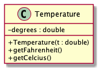
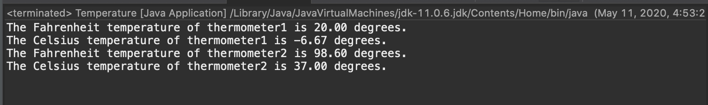

# Temperature report
Author: Thien Nguyen 

## UML class diagram

```

@startuml

skinparam classAttributeIconSize 0
class Temperature{
- degrees : double

+ Temperature(t : double)
+ getFahrenheit()
+ getCelcius()
}
@enduml

```



## Specification

 Class Temperature : This class represent a temperature in degree Fahrenheit. 
 It is able to convert the temperature to degree Celsius and output the result to the console.  
 

## Execution and Testing


