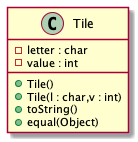

# Tile report
Author: Thien Nguyen

## UML class diagram
```
@startuml
class Tile{
-letter : char
-value : int
+Tile()
+Tile(l : char,v : int)
+toString()
+equal(Object)
}
@endulm

```

## Specification
Class: Tile
This class represent tile objects in the game Scrabble.
This class store a character and a value. It can also compare 2 different tile to see if their values matches.

## Execution and Testing


